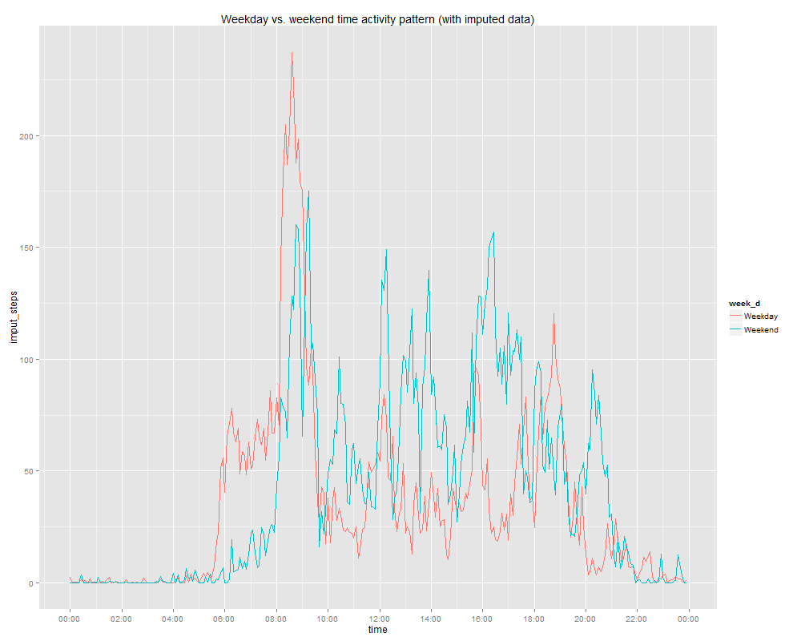

The instructions for the assignment are in the [PDF file](https://github.com/ccaudillo/RepData_PeerAssessment1/blob/master/doc/instructions.pdf). This document will only include the code for the answers of the assignment. 

## Loading and preprocessing the data

In this chunk the first six lines are to access the file from the URL, download and unzip it in a local directory. If the directory ./data doesn't exist we will create it. 

```{r}
# library(httr)
# library(httpuv)
# if(!file.exists("./data")){dir.create("./data")}
# fileUrl <- "https://d396qusza40orc.cloudfront.net/repdata%2Fdata%2Factivity.zip"
# download.file(fileUrl,destfile="./data/rep-data-activity.zip")
# unzip("./data/rep-data-activity.zip", exdir = "./data")


restData <- read.csv("~/data/activity.csv")


```


## What is mean total number of steps taken per day?

Part 1. Make a histogram of the total number of steps taken each day


```{r 1 Mean total number of steps}
library(ggplot2)
library(lubridate)

restData$Date <-as.Date(restData$date, format='%Y-%m-%d')

sumDay <-aggregate(restData$steps, list(Date = restData$Date), sum, na.rm= TRUE)
colnames(sumDay) <- c("Date","steps")

stepHist <- ggplot(sumDay, aes(Date,steps) ) + geom_bar(stat="identity", alpha = 0.6) + ggtitle("Total number of steps per day")

stepHist

dev.copy(png, file = "histogram1.png", width = 1000, height = 800 ) # Saving Plot to local directory. then copy it to the figures folder in the local repository 
dev.off()

````
 

Part 2. Calculate the mean and median total number of steps taken each day

```{r}
mean(sumDay$steps, na.rm=TRUE)
median(sumDay$steps, na.rm=TRUE)

````

The mean steps per day are **9354.23**, and the median steps per dat are **10395**.


## What is the average daily activity pattern?

Part 1. Make a time series plot of the 5-minute interval (x-axis)
and the average number of steps taken, averaged across all days (y-axis)

```{r average activity pattern 1}

library(scales)

# Agregate mean activity per time interval
avstep <- aggregate(steps~interval,restData,mean,na.rm = TRUE) 

# Transform the time+interval variable to date/time
avstep$time <- as.POSIXct(with(avstep,paste(interval %/% 100, interval %% 100, sep=":")),format="%H:%M")


# The Plot
stepPlot1 <- ggplot(avstep,aes(x=time,y=steps)) + geom_line()  +  scale_x_datetime(breaks = date_breaks("2 hour"),labels = date_format("%H:%M")) + ggtitle(("Average steps per 5 minute interval"))

print(stepPlot1)


dev.copy(png, file = "AverageActivity.png", width = 1000, height = 800 ) # Saving Plot to local directory. then copy it to the figures folder in the local repository 
dev.off()


````

Part 2. Which 5-minute interval, on average across all the days in the dataset,
contains the maximum number of steps?

```{r maximun activity time interval}

maxint <- subset(avstep, steps == max(avstep$steps))
maxi <- data.frame(DateTime=maxint$time,
  time=format(as.POSIXct(maxint$time, format="%Y-%m-%d %H:%M"), format="%H:%M"))

maxi$time

````

The maximun average steps per 5 minute interval is 206.2, at 8:35


## Imputing missing values

Part 1. Calculate and report the total number of missing values in the dataset

```{r 1 total rows NA is the dataset}
sapply(restData, function(x) sum(is.na(x)))

````
The only variable with NAs is 'steps' with 2304 missing values.


Part 2. Devise a strategy for filling in all of the missing values in the dataset. The strategy does not need to be sophisticated. For example, you could use the mean/median for that day, or the mean for that 5-minute interval, etc.

```{r}
# Aggregating by date in wich steps is missing

miss <- aggregate(cnt~date,cbind(restData[is.na(restData$steps),],cnt=c(1)),sum,na.rm = FALSE)
# Adding week day variable
miss$wd <- weekdays(as.Date(miss$date),abbreviate=TRUE)
miss
````
There are complete days 8 missing, each day has 288 5 minutes intervals

Now let's create a dataset aggregating the complete data averaging by weekday and 5-minute interval

```{r}

comp <- aggregate(steps~interval+weekdays(Date,abbreviate=TRUE),restData,FUN=mean,na.rm=TRUE)
colnames(comp) <- c("interval","wd","avg_steps")

````

Imputing the average steps by week of the day and 5-minute inteval

```{r}

# Adding the day of the week to de original data
restData$wd <- weekdays(restData$Date,abbreviate=TRUE)


imp <- merge(restData,comp,by=c("wd","interval"),all.x = TRUE)
imp <- imp[with(imp,order(date,interval)),]

imp$imput_steps <- ifelse(is.na(imp$steps),imp$avg_steps,imp$steps)


````

Part 4. Make a histogram of the total number of steps taken each day and Calculate and report the mean and median total number of steps taken per day. Do these values differ from the estimates from the first part of the assignment?

```{r Activity pattern by 5-minute interval}

sumDay2 <-aggregate(imp$imput_steps, list(Date = restData$Date), sum, na.rm= TRUE)
colnames(sumDay2) <- c("Date","steps")

stepHist <- ggplot(sumDay2, aes(Date,steps) ) + geom_bar(stat="identity", alpha = 0.6) + ggtitle("Total number of steps per day (with imputed values)")

stepHist

dev.copy(png, file = "histogram2.png", width = 1000, height = 800 ) # Saving Plot to local directory. then copy it to the figures folder in the local repository 
dev.off()

mean(sumDay2$steps, na.rm=TRUE)
median(sumDay2$steps, na.rm=TRUE)

````


What is the impact of imputing missing data on the estimates of the total daily number of steps?

When we plot the imputed data there are no empty columns in the graph. The mean daily steps now is **10821.21** and the median **11015**


## Are there differences in activity patterns between weekdays and weekends?

Part 1. Create a new factor variable in the dataset with two levels - "weekday"
and "weekend" indicating whether a given date is a weekday or weekend day.
```{r}
library(plyr)

imp$week_d <- mapvalues(imp$wd, from = c("dom", "jue", "lun", "mar", "mié",  "sáb", "vie" ), to = c("Weekend", "Weekday","Weekday","Weekday","Weekday", "Weekend","Weekday"))

week_day <- aggregate(imput_steps~interval+week_d,imp,FUN=mean,na.rm=TRUE)


# Transform the time+interval variable to date/time
week_day$time <- as.POSIXct(with(week_day,paste(interval %/% 100, interval %% 100, sep=":")),format="%H:%M")

````
Part 2. Make a panel plot containing a time series plot (i.e. type = "l") of the
5-minute interval (x-axis) and the average number of steps taken, averaged across all weekday days or weekend days (y-axis).
```{r}


w_plot <- ggplot(week_day,aes(x=time,y=imput_steps, group=week_d, colour = week_d)) + geom_line() + 
          scale_x_datetime(breaks = date_breaks("2 hour"),labels = date_format("%H:%M")) +  ggtitle(("Weekday vs. weekend time activity pattern (with imputed data)"))

w_plot


dev.copy(png, file = "w_plot.png", width = 1000, height = 800 ) # Saving Plot to local directory. then copy it to the figures folder in the local repository 
dev.off()

````

